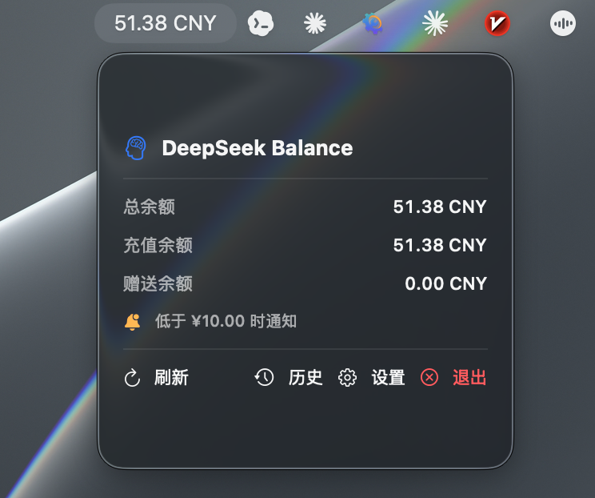
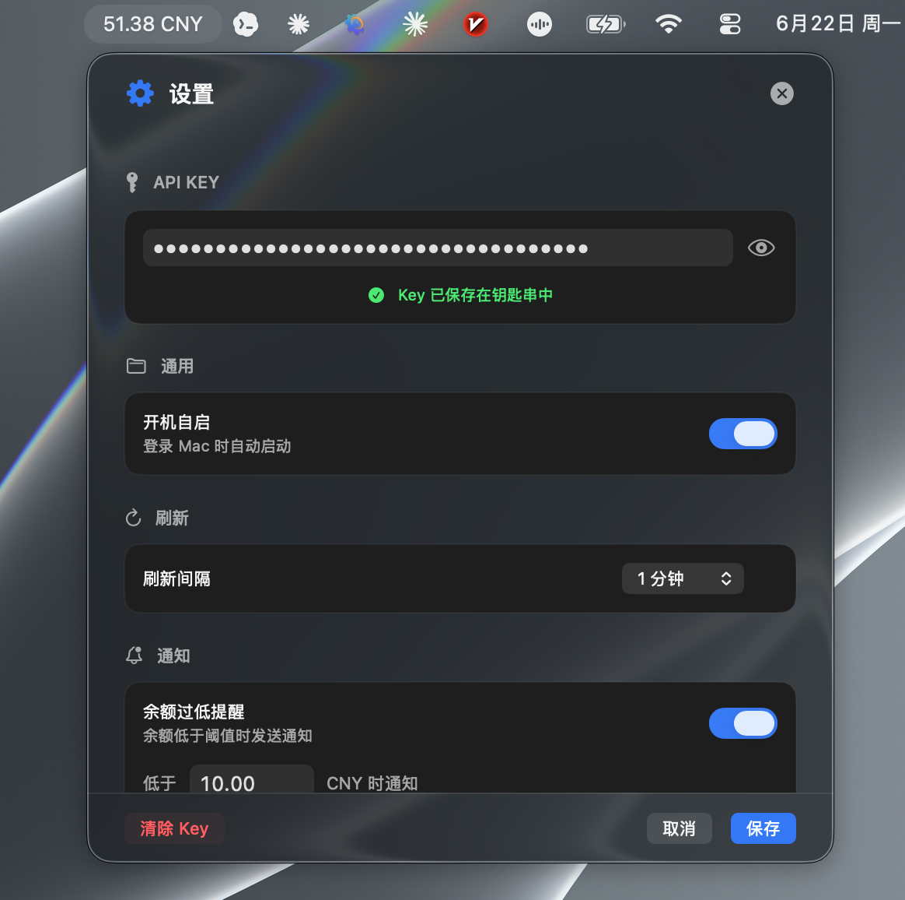
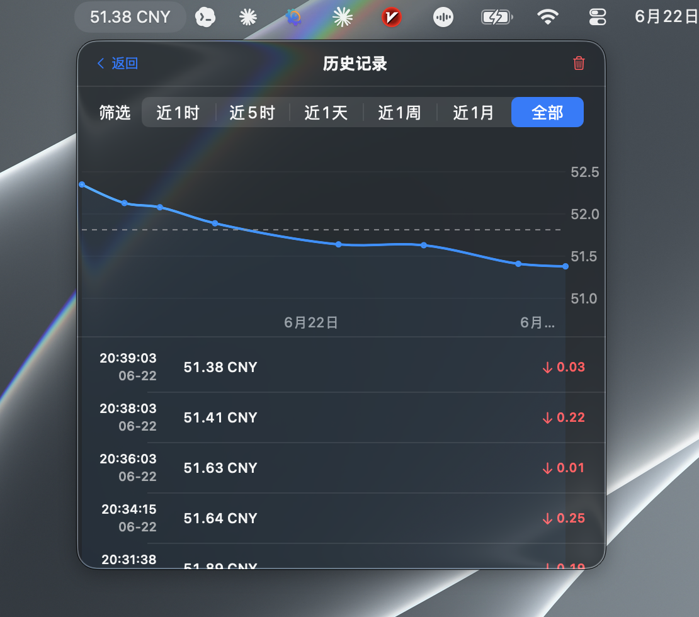

[中文版](README.zh.md)

# DeepSeek Balance

A lightweight macOS menu bar app that displays your DeepSeek API account balance in real-time.





*Balance overview · Settings panel · History with line chart*

---

## Features

- **Real-time Balance** — Shows total, topped-up, and granted balance directly in the menu bar
- **Change Indicator** — Green ↑ for increase, Red ↓ for decrease; auto-fades after 15 seconds
- **Low Balance Notification** — Native macOS notification fires when balance drops below a configurable threshold
- **Balance History** — Auto-records snapshots on every change; viewable as a line chart with adjustable time filters (1h / 5h / 1d / 1w / 1m / All)
- **Custom Refresh Interval** — Choose from 10s, 1min, 5min, 15min, 30min, or 1h
- **Launch at Login** — Starts automatically when you log in
- **Keychain Security** — API key is stored in macOS Keychain, never in plaintext

## Requirements

- macOS 14.0+ (Sonoma)
- Apple Silicon or Intel
- A DeepSeek API key from [platform.deepseek.com](https://platform.deepseek.com)

## Installation

### Download

Grab the latest `DeepSeekBalance.app` from the [Releases](https://github.com/pj-workspace/DeepSeekBalance/releases) page and move it to `/Applications`.

### Build from Source

```bash
git clone https://github.com/pj-workspace/DeepSeekBalance.git
cd DeepSeekBalance
./build.sh
cp -r DeepSeekBalance.app /Applications/
```

Requires Xcode Command Line Tools:

```bash
xcode-select --install
```

## First Run

1. Launch `DeepSeekBalance.app`
2. Click the menu bar icon → **Settings**
3. Enter your DeepSeek API key (get one at [platform.deepseek.com/api_keys](https://platform.deepseek.com/api_keys))
4. Click **Save**
5. The balance appears in your menu bar immediately

> For **Launch at Login** to work, place the app in `/Applications`.

## Configuration

| Setting | Options / Description |
|---------|----------------------|
| API Key | Stored in macOS Keychain |
| Launch at Login | On / Off |
| Refresh Interval | 10s / 1min / 5min / 15min / 30min / 1h |
| Low Balance Alert | Threshold (CNY) + native macOS notification |

## Project Structure

```
DeepSeekBalance/
├── Sources/DeepSeekBalance/
│   ├── DeepSeekBalanceApp.swift    # @main, MenuBarExtra, dropdown views
│   ├── DeepSeekAPIService.swift    # Balance API client
│   ├── BalanceViewModel.swift      # State management & business logic
│   ├── SettingsView.swift          # Settings panel UI
│   ├── HistoryView.swift           # History chart & filterable list
│   └── KeychainHelper.swift        # macOS Keychain CRUD
├── assets/                         # README screenshots
├── build.sh                        # Build & sign script
├── Package.swift                   # SPM manifest (reference)
├── README.md
└── LICENSE
```

## Tech Stack

- **Swift 6** + SwiftUI
- `MenuBarExtra` — native macOS menu bar integration
- `Charts` framework — interactive line chart for balance history
- `Security` framework — Keychain access for API key storage
- `ServiceManagement` — Launch at login support
- `UserNotifications` — Low balance alerts

## License

MIT License — see [LICENSE](LICENSE).

---

Made by [Jay Pan (pj-workspace)](https://github.com/pj-workspace)
